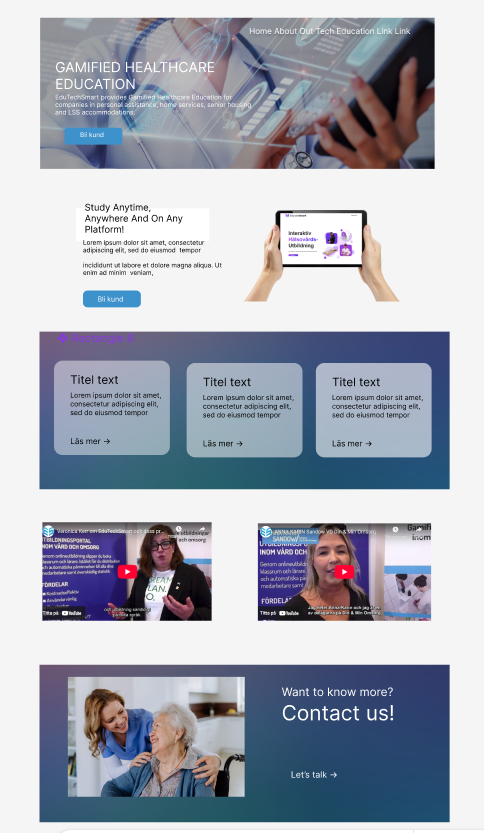

# EduTechSmart Landing page
Det här är vårt teams vision kring en ny Landing page. Vi ville göra en mobilanpassad omarbetning av den nuvarande och modernisera designen.

[En deploy av sidan på Github Pages](https://isabellea-f.github.io/edutechsmart-landingpage/)

[Länk till repositoriet](https://github.com/isabellea-f/edutechsmart-landingpage/)

## Status
🏆 **Uppnådda mål** 
- Skapat en projektstruktur
- Skapat en backlog
- Skapat denna README
- Tagit fram en ny grovdesign
- Valt en tjusig färgskala
- Riggat upp sidans byggställning
- Snickrat upp ytterväggar och tak
- En ny bländande Hero!
- Fräscha info-sektioner ala mode!
- Inbjudande sociala länkar

💡 **Lysande idéer för framtiden**
- En flipswitch för svenska/engelska

## Vår designplan
Så här gick våra tankar när vi satt i en ring och hjärnstormade som aldrig förr!

Ett grundläggande utkast trädde fram efter konstruktivt dividerande om designprinciper, kundönskemål och användarupplevele:

Sen hade vi ett givande och väldigt **respektfullt** meningsutbyte angående färger och tycke och smak, vilket ledde fram till denna välbalanserade färgskala:

Och med den färgskalan på plats landade snart nog även en mer detaljerad designplan:

## Varför vårt upplägg?
Vi har sett potentialet i den befintliga sidan, lyft upp det till ytan och ramat in det i en modern inramning med fokus på att nå användarna där de är - på mobilskärmen eller på den breda, kurvade desktop-skärmen!  

## Teamet bakom
Alyanna

Björn

Elias

Isabelle

Sascha
