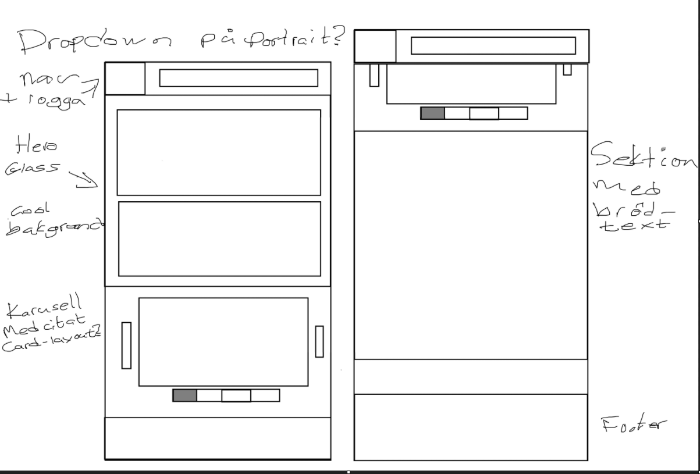
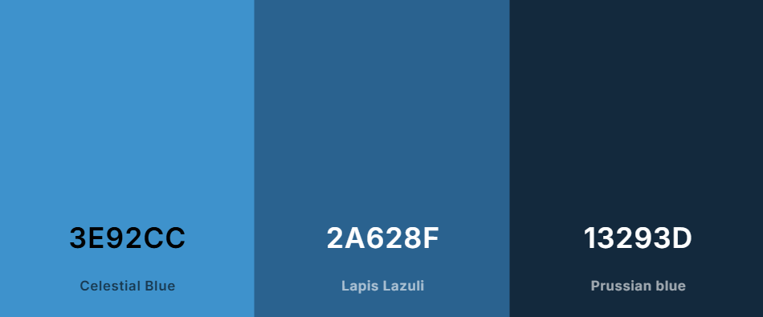

# EduTechSmart Landing page
Det här är vårt teams vision kring en ny Landing page. Vi vill göra en mobilanpassad omarbetning av den nuvarande och modernisera designen.

## Status
| 🏆 Hittills bestigna berg | 💡 Planerade landvinningar |
| ---------------------- |----------------------- |
| Skapat en projektstruktur | En flipswitch för svenska/engelska |
| Skapat en backlog | Fräscha info-sektioner ala mode! |
| Skapat denna README | Inbjudande sociala länkar |
| Tagit fram en ny grovdesign | Läcker interaktiv grafik |
| Valt en tjusig färgskala |
| Riggat upp sidans byggställning |
| Snickrat upp ytterväggar och tak |
| En ny bländande Hero! |

## Vår designplan
Så här gick våra tankar när vi satt i en ring och hjärnstormade som aldrig förr!

Ett grundläggande utkast trädde fram efter konstruktivt dividerande om designprinciper, kundönskemål och användarupplevele:

Sen hade vi ett givande och väldigt **respektfult** meningsutbyte angående färger och tycke och smak, vilket ledde fram till denna välbalanserade färgskala:

## Varför vårt upplägg?
Vi har sett potentialet i den befintliga sidan, lyft upp det till ytan och ramat in det i en modern inramning med fokus på att nå användarna där de är - på mobilskärmen eller på den breda, kurvade desktop-skärmen!  
